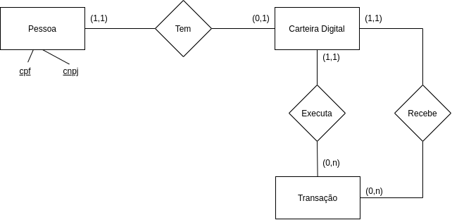

# Regras de negócio

O sistema deve permitir transações financeiras entre pessoa física e pessoas jurídicas/físicas, sendo que o beneficiado recebe uma notificação ao receber a transferência. 

Para isso foi proposta a seguinte estrutura macro de banco:

É importante citar que cnpj e cpf são únicos no sistema.

O banco foi implementado em postgres 11.5 e seu script consta na pasta migrations que é executada pelo Symfony.

A aplicação segue o seguinte conceito:

Por fim segue o fluxo macro implementado:

Note que as notificações são enfileiradas e serão executadas por um job a parte.

### [Voltar para página inicial](../README.md)